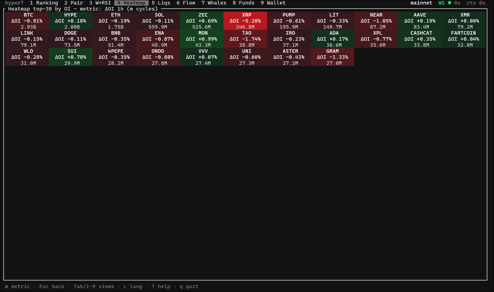
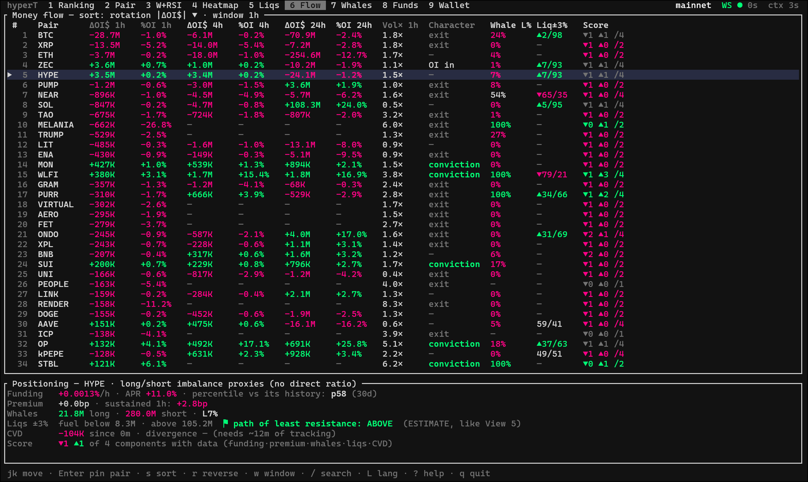
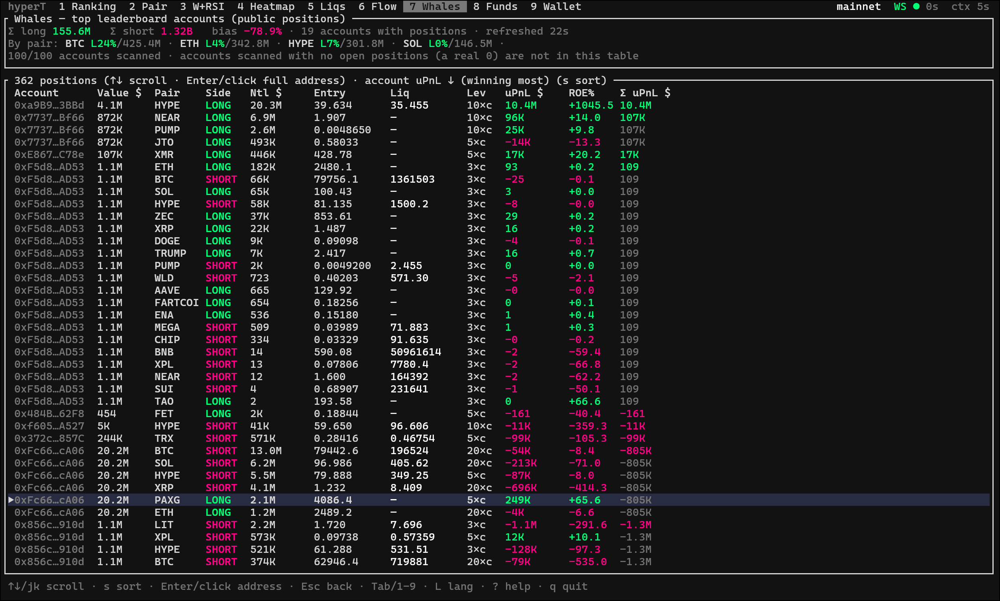
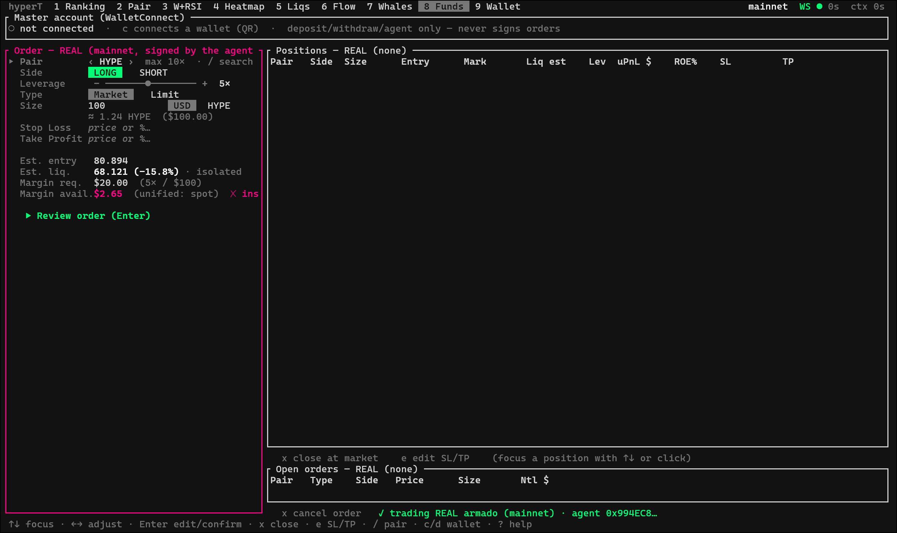
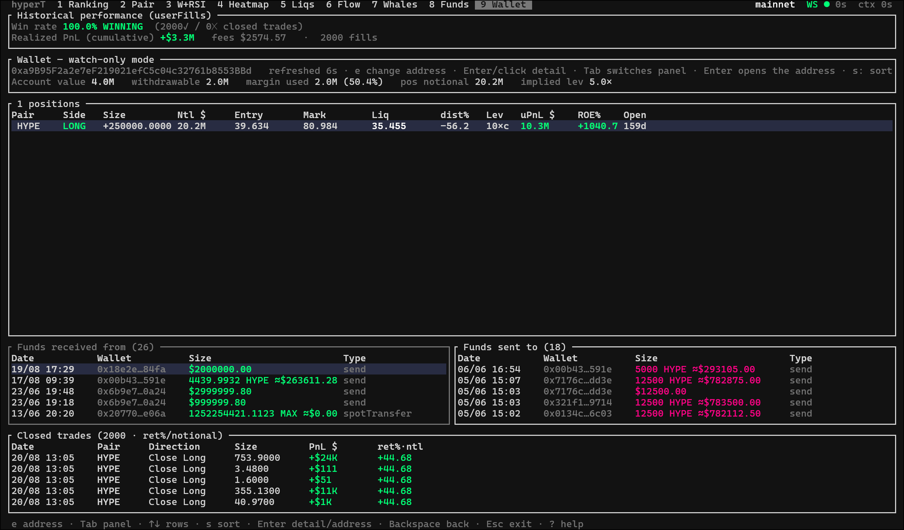

# hyperT

[English](README.md) | [Español](README.es.md)

Panel de análisis y trading nativo de terminal para [Hyperliquid](https://hyperliquid.xyz), escrito en Rust con [ratatui](https://ratatui.rs). Pensado para swing/position trading (posiciones de varios días), no para scalping automatizado de alta frecuencia.

Con licencia [AGPL v3](LICENSE) — libre de usar y modificar; si distribuyes una versión modificada (incluido ofrecerla como servicio en red), el código fuente de esa versión también debe estar disponible.

<!--  -->

Los gráficos y osciladores se renderizan como imágenes reales con antialiasing vía el **protocolo gráfico de Kitty** (a través de [`ratatui-image`](https://github.com/benjajaja/ratatui-image) + [`plotters`](https://github.com/plotters-rs/plotters)) en lugar de los típicos gráficos de puntos braille que se ven en la mayoría de TUIs, con un fallback automático a medios-bloques Unicode en terminales que no lo soportan.

## Requisitos

- **Rust** (toolchain estable — se recomienda `rustup`).
- **Terminal**: para el mejor renderizado visual, usa un terminal que implemente el protocolo gráfico de Kitty — [Kitty](https://sw.kovidgoyal.net/kitty/), [Ghostty](https://ghostty.org) o [WezTerm](https://wezterm.org). Cualquier otro terminal funciona igualmente, cayendo al renderizado con medios-bloques Unicode.
- No se necesitan claves de API ni cuentas para la Fase 1 (solo lectura) — habla directamente con la Info API y el WebSocket públicos de Hyperliquid.

## Ejecución

```sh
cargo run --release                # mainnet, solo lectura
cargo run --release -- --testnet   # testnet, solo lectura
```

Opcional: apunta la app a un daemon externo de backfill (ver [Daemon de backfill](#opcional-daemon-de-backfill-para-histórico-persistente) más abajo) para que las ventanas de historial en memoria (ΔOI, CVD, delta por vela) arranquen ya pobladas en vez de vacías:

```sh
cargo run --release -- --oi-source http://<host-del-daemon>:<puerto>
```

Una sonda sin interfaz para validar la capa de datos (REST + WebSocket) sin el TUI:

```sh
cargo run --bin probe
```

## Visión general de la arquitectura

- **Capa de datos** (`src/data/`): un conjunto de tareas asíncronas que sondean el endpoint REST `metaAndAssetCtxs` de Hyperliquid cada 5s (funding, open interest, premium, precio oracle) más suscripciones WebSocket — `allMids` para los 200+ pares, una suscripción dinámica `bbo` por par seleccionado (actualizaciones sub-segundo), y una suscripción `trades` por par seleccionado (para CVD / delta por vela). Las velas y el historial de funding se piden bajo demanda al fijar un par.
- **Señales** (`src/signals.rs`, `src/flow.rs`): funciones puras sobre los datos recolectados — RSI/ADX/DMI, el indicador compuesto de detección de ballenas, percentil de funding, asimetría de combustible de liquidación, divergencia de CVD, el score de sobreextensión cross-pair. Testeadas de forma independiente a la interfaz.
- **Renderizado** (`src/ui/`): widgets de ratatui para las vistas tabulares/de texto, más un pipeline compartido de oscilador-a-imagen (`src/ui/oscimg.rs`) para todo lo que se renderiza como gráfico real (paneles RSI/ADX/DMI, barras de delta por vela).
- **Wallet** (`src/wallet/`) y **ejecución** (`src/trader.rs`, `src/exec.rs`): Fase 2, funcionalidad con fondos reales — ver [Fase 2](#fase-2--wallet-y-ejecución) más abajo.

## Vistas

Pulsa `1`–`9` o `Tab` para cambiar. Las vistas 1–7 y 9 son enteramente de solo lectura; la vista 8 es donde vive la conexión de wallet y (opcionalmente) la ejecución real de órdenes.

**1 — Ranking.** Todos los perpetuos listados con precio en vivo (vía WebSocket), variación 24h, tasa de funding horaria y su APR anualizado, premium perp/oracle en basis points, open interest (notional), ΔOI en ventanas de 5m/1h, y una clasificación de flujo derivada de cruzar la dirección del ΔOI con la dirección del precio (longs abriéndose / shorts abriéndose / longs cerrándose / shorts cerrándose). Ordenable por cualquier columna (`s`), con un overlay de búsqueda incremental (`/`).

**2 — Par.** Detalle completo de un par: velas OHLC sólidas (no puntos braille) en 7 temporalidades (1m/5m/15m/1h/4h/12h/1d, cicladas con `i`), un eje de precio con gridlines, hover del ratón mostrando OHLC/volumen/antigüedad por vela, un sub-panel apilado con RSI(14) + ADX/DMI(14) renderizado como gráfico real alineado al mismo eje temporal que las velas, un panel de barras de delta por vela (volumen agregado comprador vs. vendedor agresor por vela, del feed de trades en vivo), historial de funding (~3 días), y sparklines de OI/mid. RSI/ADX son explícitamente confirmación secundaria, nunca una señal por sí sola.

**3 — Whales + RSI/ADX/DMI.** Un indicador técnico portado (originalmente un Pine Script usado en TradingView) que marca posibles momentos de "compra/venta de ballena": la vela toca un extremo de una Banda de Bollinger de precio *y* el RSI está en un extremo *y* el ADX es bajo (es decir, busca reversión a la media en un mercado sin tendencia fuerte, no continuación). Muestra el RSI clásico + su MA, un RSI modificado (%B de una Banda de Bollinger de precio, reescalado), ADX/±DI, columnas de intensidad con marcadores ▲/▼ en los puntos de disparo, un checklist en vivo de las cinco condiciones por lado, y un log de los últimos disparos. Es análisis técnico puro sobre precio — sin ninguna señal on-chain u OI involucrada, claramente separado de las señales basadas en OI del resto de la app.

**4 — Heatmap (top-OI).** Los ~30 pares principales por open interest, coloreados por una métrica seleccionable (`m` cicla: funding APR / ΔOI 1h / variación 24h). Limitado deliberadamente a ~30 pares — con 200+ perpetuos listados, un heatmap que cubra todos deja de ser legible de un vistazo.



**5 — Liquidaciones (estimado).** Una estimación estadística de dónde es probable que se concentre la presión de liquidación, construida a partir de open interest × volumen reciente × tramos de apalancamiento típicos — **no** son datos exactos (ningún exchange publica precios de liquidación reales por posición). Etiquetado explícitamente `ESTIMADO` en la interfaz. Incluye un panel experimental aparte que porta un indicador Pine Script de "densidad de liquidación por ΔOI", que necesita ~61 velas de historial de OI *acumulado localmente* por temporalidad para producir resultados (la API de Hyperliquid no tiene endpoint de histórico de OI) — ver [Daemon de backfill](#opcional-daemon-de-backfill-para-histórico-persistente).

**6 — Flujo de Dinero / Posicionamiento.** Responde a dos preguntas: "¿hacia dónde está rotando el capital entre pares?" y "¿está el mercado sobrecargado hacia un lado?". Componentes: (1) rotación de OI cross-pair en ventanas de 1h/4h/24h, distinguiendo movimientos de alto volumen ("convicción") de acumulación silenciosa de bajo volumen; (2) tasa de funding comparada contra su propio percentil de 30 días (un percentil extremo marca un mercado inusualmente desequilibrado para *ese activo en concreto*, no un umbral absoluto), cruzado con el skew long/short de las ballenas — la señal más fuerte es cuando el sentimiento de funding del retail y el posicionamiento de las ballenas discrepan; (3) asimetría de combustible de liquidación ±3% alrededor del precio mark (más combustible abajo = camino más fácil hacia abajo si arranca un movimiento, vía liquidaciones en cascada, y viceversa), ordenable y combinable con el score compuesto; (4) CVD (delta de volumen acumulado) sobre el feed de trades en vivo del par seleccionado, marcando divergencia contra el precio (precio plano + CVD subiendo = absorción); (5) un score compuesto de sobreextensión que cuenta cuántos de los extremos anteriores coinciden en el mismo lado para un par dado — un ranking de vigilancia, no una señal de entrada automática.



**7 — Whales.** Escanea las ~100 cuentas principales del leaderboard de Hyperliquid y trae el `clearinghouseState` de cada una (posiciones abiertas, tamaño, PnL no realizado) en un ciclo continuo de 60s. Ordenable por notional de la cuenta o por PnL no realizado agregado (ascendente/descendente). Pulsa `Enter` en cualquier fila para ver/copiar la dirección completa (sin truncar), por ejemplo para seguirla en la vista 9.



**8 — Fondos** *(Fase 2)*. Conecta cualquier wallet EVM vía WalletConnect v2 (código QR renderizado en el propio terminal) como cuenta maestra para depósitos, retiros, y autorización de agent wallet. Ver [Fase 2](#fase-2--wallet-y-ejecución).



**9 — Wallet (watch-only).** Introduce cualquier dirección pública de Hyperliquid para seguirla: saldo en vivo, margen, posiciones abiertas con distancia a liquidación en tiempo real, ordenable por antigüedad / notional / ROE con un marcador visual para posiciones abiertas en las últimas 24h, un resumen de win-rate realizado y PnL a partir del historial de fills, y un panel de "wallets relacionadas" — direcciones que han enviado fondos a, o recibido fondos de, la dirección seguida (solo transferencias internas de Hyperliquid, no rastreo on-chain completo), navegable con `Enter` para pivotar la wallet seguida y `Backspace` para volver atrás.



## Fase 2 — wallet y ejecución

La Fase 2 añade funcionalidad con fondos reales sobre la Fase 1 de solo lectura: conectar una wallet EVM (WalletConnect v2), depositar/retirar USDC vía el puente de Arbitrum, autorizar una **agent wallet** con permisos acotados (una clave guardada localmente con permiso de trading pero *sin permiso de retiro*, para que la firma de órdenes del día a día no requiera reaprobar desde el móvil en cada operación), y un panel de ejecución completo (órdenes de mercado/límite, apalancamiento, SL/TP, gestión de posiciones) utilizable tanto contra testnet como contra mainnet.

Modelo de seguridad, en resumen:
- La conexión de la wallet maestra (MetaMask, Rabby, o cualquier wallet EVM compatible con WalletConnect) se usa solo para depósitos, retiros y autorización de la agent wallet — nunca para la firma de órdenes del día a día.
- La agent key se genera localmente y nunca sale de la máquina donde se creó; está excluida del control de versiones por defecto.
- Enviar una orden real en mainnet requiere teclear una frase de confirmación, no una sola pulsación.
- El precio de liquidación estimado siempre se muestra *antes* de confirmar cualquier orden apalancada, nunca solo después.

Esta parte del proyecto está en desarrollo y pruebas activas — trátala como tal si construyes sobre ella.

## Opcional: daemon de backfill para histórico persistente

Varias señales de la app acumulan historial puramente **en memoria** mientras el TUI está corriendo, porque la API de Hyperliquid no expone open interest histórico ni datos de trades históricos — solo lo que estás escuchando en vivo. Esto significa que las ventanas de ΔOI (5m/1h/4h/24h), el CVD, el delta por vela, y el indicador experimental de densidad de liquidación arrancan todos desde cero (`—`) en cada reinicio, y necesitan tiempo real de reloj para llenarse.

Para evitar esto, puedes correr un pequeño daemon independiente (no incluido en este repo, pero sencillo de construir: un poller de larga duración de `metaAndAssetCtxs` + un listener del WebSocket de `trades`, escribiendo snapshots con marca de tiempo en SQLite, con un endpoint HTTP mínimo de solo lectura) en cualquier máquina siempre encendida de tu red — una Raspberry Pi de sobra, un teléfono viejo reutilizado con Termux, un VPS pequeño, lo que tengas. Apunta hyperT ahí:

```sh
cargo run --release -- --oi-source http://<host-del-daemon>:<puerto>
```

Al arrancar, hyperT pedirá un backfill del historial reciente a ese endpoint para los pares que necesita (cayendo en silencio al comportamiento normal de arrancar vacío y acumular si la URL no está configurada o el daemon no responde — esto es **estrictamente opcional**, la app funciona perfectamente sin ello). En mi propio setup esto corre en un teléfono Android reutilizado vía Termux, sondeando continuamente los ~30 pares principales por open interest, lo cual es suficiente para que las ventanas de ΔOI/CVD estén pobladas desde el momento en que se abre el TUI en vez de resetearse en cada sesión.

## Atajos de teclado

`1`–`9` / `Tab` — cambiar de vista · `↑↓` / `j k` — moverse · `Enter` — abrir/fijar par, confirmar · `s` — ordenar · `r` — invertir orden · `←→` / `h l` — par anterior/siguiente · `i` — temporalidad · `m` — métrica del heatmap · `w` — ventana de flujo · `/` — buscar · `L` — alternar idioma (EN/ES) · `?` — ayuda · `q` — salir

(Los atajos completos por vista se muestran en el overlay de ayuda dentro de la app, `?`.)

## Notas sobre los datos

- `metaAndAssetCtxs` se sondea cada 5s (funding, OI, premium, precio oracle). El ΔOI se calcula sobre ese historial en memoria — las ventanas de 5m/1h necesitan que la app lleve corriendo aproximadamente ese tiempo para poblarse. La vista 6 además mantiene un historial de cadencia más lenta (1 muestra/min, ~25h) para sus ventanas de 1h/4h/24h; estas muestran `—` hasta acumular suficiente tiempo de actividad — este es el comportamiento esperado, no un bug.
- Los mids llegan en vivo vía la suscripción WebSocket `allMids`; el par seleccionado obtiene además una suscripción `bbo` dedicada sub-segundo.
- Las velas y el historial de funding (~30d, paginado) se piden bajo demanda al fijar un par.
- El CVD y el delta por vela se suscriben al canal `trades` solo del par actualmente seleccionado (para mantener razonable la carga de WebSocket con 200+ pares listados).
- Todas las cifras relacionadas con liquidaciones (vista 5, y el componente de asimetría de combustible de la vista 6) son **estimaciones** derivadas de OI y supuestos de apalancamiento típico — ningún exchange expone datos exactos de liquidación por posición.

## Aviso legal

Nada en esta app es asesoramiento financiero. Cada señal derivada (percentil de funding, skew de ballenas, asimetría de combustible de liquidación, divergencia de CVD, el score compuesto) es una pieza de contexto, no una recomendación — y varias de ellas son estimaciones explícitas, etiquetadas como tal en la interfaz. El trading de futuros perpetuos apalancados conlleva un alto riesgo de pérdida. Si usas la funcionalidad de ejecución de la Fase 2 con fondos reales, pruébala a fondo contra testnet primero, verifica cada dirección de destino y cantidad antes de confirmar, y empieza con posiciones pequeñas.

## Licencia

[GNU AGPL v3](LICENSE)
