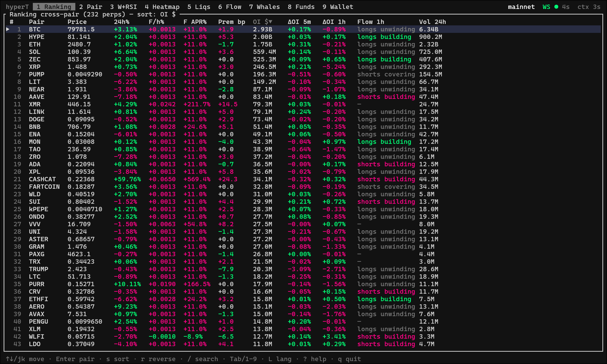
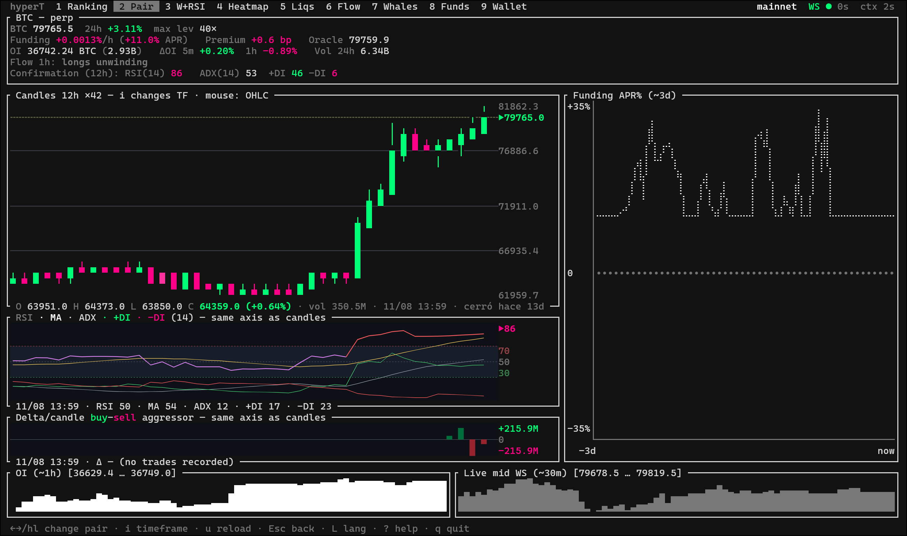
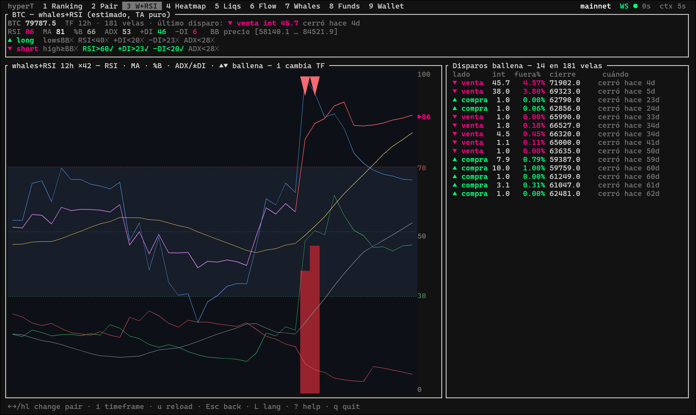

# hyperT

[English](README.md) | [Español](README.es.md)

A terminal-native trading and market-analysis dashboard for [Hyperliquid](https://hyperliquid.xyz), written in Rust with [ratatui](https://ratatui.rs). Built for swing / position trading (multi-day holds), not for automated high-frequency scalping.

Licensed under [AGPL v3](LICENSE) — free to use and modify; if you distribute a modified version (including running it as a network service), the source of that version must also be made available.

<!--  -->

Charts and oscillators render as real antialiased images via the **Kitty graphics protocol** (through [`ratatui-image`](https://github.com/benjajaja/ratatui-image) + [`plotters`](https://github.com/plotters-rs/plotters)) instead of the usual braille-dot plots you see in most TUIs, with an automatic fallback to Unicode half-blocks on terminals that don't support it.

## Requirements

- **Rust** (stable toolchain — `rustup` recommended).
- **Terminal**: for the best-looking charts, use a terminal that implements the Kitty graphics protocol — [Kitty](https://sw.kovidgoyal.net/kitty/), [Ghostty](https://ghostty.org), or [WezTerm](https://wezterm.org). Any other terminal still works fully, falling back to Unicode half-block rendering.
- No API keys or accounts needed for Phase 1 (read-only) — it talks directly to Hyperliquid's public Info API and WebSocket.

## Running

```sh
cargo run --release                # mainnet, read-only
cargo run --release -- --testnet   # testnet, read-only
```

Optional: point the app at an external backfill daemon (see [Backfill daemon](#optional-backfill-daemon-for-persistent-history) below) so in-memory history windows (ΔOI, CVD, delta-per-candle) start populated instead of empty:

```sh
cargo run --release -- --oi-source http://<daemon-host>:<port>
```

A headless probe for validating the data layer (REST + WebSocket) without the TUI:

```sh
cargo run --bin probe
```

## Architecture overview

- **Data layer** (`src/data/`): a set of async tasks polling Hyperliquid's `metaAndAssetCtxs` REST endpoint every 5s (funding, open interest, premium, oracle price) plus WebSocket subscriptions — `allMids` for all 200+ pairs, a dynamic per-selected-pair `bbo` subscription (sub-second updates), and a per-selected-pair `trades` subscription (for CVD / delta-per-candle). Candles and funding history are fetched on demand when you pin a pair.
- **Signals** (`src/signals.rs`, `src/flow.rs`): pure functions over the collected data — RSI/ADX/DMI, the whale-detection composite indicator, funding percentile, liquidation-fuel asymmetry, CVD divergence, the cross-pair overextension score. Unit-tested independently of the UI.
- **Rendering** (`src/ui/`): ratatui widgets for the tabular/text views, plus a shared oscillator-to-image pipeline (`src/ui/oscimg.rs`) for anything rendered as a real chart (RSI/ADX/DMI panels, delta-per-candle bars).
- **Wallet** (`src/wallet/`) and **execution** (`src/trader.rs`, `src/exec.rs`): Phase 2, real-funds functionality — see [Phase 2](#phase-2--wallet-and-execution) below.

## Views

Press `1`–`9` or `Tab` to switch. Views 1–7 and 9 are entirely read-only; view 8 is where wallet connection and (optionally) real order execution live.

**1 — Ranking.** Every listed perpetual with live price (via WebSocket), 24h % change, hourly funding rate and its annualized APR, perp/oracle premium in basis points, open interest (notional), ΔOI over 5m/1h windows, and a flow classification derived from crossing ΔOI direction against price direction (longs opening / shorts opening / longs closing / shorts closing). Sortable by any column (`s`), with an incremental fuzzy search overlay (`/`).



**2 — Pair.** Full detail for a single pair: solid OHLC candles (not braille dots) across 7 timeframes (1m/5m/15m/1h/4h/12h/1d, cycled with `i`), a price-axis with gridlines, mouse hover showing OHLC/volume/age per candle, a stacked sub-panel with RSI(14) + ADX/DMI(14) rendered as a real chart aligned to the same time axis as the candles, a delta-per-candle bar panel (aggregate buy vs. sell aggressor volume per candle, from the live trades feed), funding history (~3 days), and OI/mid sparklines. RSI/ADX are explicitly secondary confirmation, never a standalone signal.



**3 — Whales + RSI/ADX/DMI.** A ported technical indicator (originally a Pine Script used on TradingView) that flags likely "whale buy/sell" moments: candle touches a price Bollinger Band extreme *and* RSI is at an extreme *and* ADX is low (i.e., looking for mean-reversion in a non-trending market, not continuation). Shows classic RSI + its MA, a modified RSI (%B of a price Bollinger Band, rescaled), ADX/±DI, intensity columns with ▲/▼ markers at trigger points, a live checklist of the five conditions per side, and a log of recent triggers. This is pure technical analysis on price — no on-chain or OI signal involved, and it's clearly separate from the OI-based signals elsewhere in the app.



**4 — Heatmap (top-OI).** The top ~30 pairs by open interest, colored by a selectable metric (`m` cycles: funding APR / ΔOI 1h / 24h % change). Deliberately capped to ~30 pairs — with 200+ listed perpetuals, a heatmap covering everything stops being scannable at a glance.


**5 — Liquidations (estimated).** A statistical estimate of where liquidation pressure is likely clustered, built from open interest × recent volume × typical leverage tiers — **not** exact data (no exchange publishes real per-position liquidation prices). Explicitly labeled `ESTIMATE` in the UI. Includes a separate experimental panel porting a Pine Script "ΔOI liquidation density" indicator, which needs ~61 candles of *locally accumulated* OI history per timeframe to produce output (Hyperliquid's API has no OI history endpoint) — see [Backfill daemon](#optional-backfill-daemon-for-persistent-history).

**6 — Money Flow / Positioning.** Answers two questions: "where is capital rotating to/from across pairs" and "is the crowd overleveraged on one side". Components: (1) cross-pair OI rotation over 1h/4h/24h windows, distinguishing high-volume "conviction" moves from low-volume "quiet accumulation"; (2) funding rate compared against its own 30-day percentile (an extreme percentile flags an unusually one-sided market for *that specific asset*, not an absolute threshold), cross-referenced against whale long/short skew — the strongest signal is when retail funding sentiment and whale positioning disagree; (3) liquidation-fuel asymmetry ±3% around mark price (more fuel below = easier path downward if a move starts, via cascading liquidations, and vice versa), sortable and combinable with the composite score; (4) CVD (cumulative volume delta) on the selected pair's live trade feed, flagging divergence against price (price flat + CVD rising = absorption); (5) a composite overextension score counting how many of the above extremes line up on the same side for a given pair — a watchlist ranking, not an automated entry signal.


**7 — Whales.** Scans the top ~100 accounts on Hyperliquid's leaderboard and pulls each one's `clearinghouseState` (open positions, size, unrealized PnL) on a rolling 60s cycle. Sortable by account notional or by aggregate unrealized PnL (ascending/descending). Press `Enter` on any row to view/copy the full (untruncated) address, e.g. to track it in view 9.


**8 — Funds** *(Phase 2)*. Connect any EVM wallet via WalletConnect v2 (QR code rendered in-terminal) as the master account for deposits, withdrawals, and agent-wallet authorization. See [Phase 2](#phase-2--wallet-and-execution).


**9 — Wallet (watch-only).** Enter any public Hyperliquid address to track it: live balance, margin, open positions with real-time distance to liquidation, sortable by recency / notional / ROE with a visual marker for positions opened in the last 24h, a summary of realized win-rate and PnL from fill history, and a "related wallets" panel — addresses that have sent funds to or received funds from the tracked address (internal Hyperliquid transfers only, not full on-chain tracing), navigable with `Enter` to pivot the tracked wallet and `Backspace` to go back.


## Phase 2 — wallet and execution

Phase 2 adds real-funds functionality on top of the read-only Phase 1: connecting an EVM wallet (WalletConnect v2), depositing/withdrawing USDC via the Arbitrum bridge, authorizing a scoped **agent wallet** (a locally-held key with trading permission but *no withdrawal permission*, so day-to-day order signing doesn't require re-approving on a phone for every trade), and a full execution panel (market/limit orders, leverage, SL/TP, position management) usable against both testnet and mainnet.

Security model, briefly:
- The master wallet connection (MetaMask, Rabby, or any WalletConnect-compatible EVM wallet) is only used for deposits, withdrawals, and agent-wallet authorization — never for day-to-day order signing.
- The agent key is generated locally and never leaves the machine it was created on; it's excluded from version control by default.
- Sending a real order on mainnet requires typing a confirmation phrase, not a single keystroke.
- Estimated liquidation price is always shown *before* confirming any leveraged order, never only after.

This part of the project is under active development and testing — treat it as such if you build on it.

## Optional: backfill daemon for persistent history

Several in-app signals accumulate history purely **in memory** while the TUI is running, because Hyperliquid's API doesn't expose historical open interest or historical trade-by-trade data — only what you're subscribed to live. That means ΔOI windows (5m/1h/4h/24h), CVD, delta-per-candle, and the experimental liquidation-density indicator all start from scratch (`—`) on every restart, and take real wall-clock time to fill.

To work around this, you can run a small standalone daemon (not included in this repo, but simple to build: a long-running poller of `metaAndAssetCtxs` + a `trades` WebSocket listener, writing timestamped snapshots to SQLite, with a minimal read-only HTTP endpoint) on any always-on machine on your network — a spare Raspberry Pi, an old phone repurposed with Termux, a small VPS, whatever you have. Point hyperT at it:

```sh
cargo run --release -- --oi-source http://<daemon-host>:<port>
```

On startup, hyperT will fetch a backfill of recent history from that endpoint for the pairs it needs (falling back silently to the normal empty-then-accumulate behavior if the URL isn't set or the daemon doesn't respond — this is **strictly optional**, the app works completely fine without it). In my own setup this runs on a repurposed Android phone via Termux, polling the top ~30 pairs by open interest continuously, which is enough for the ΔOI/CVD windows to be populated from the moment the TUI opens instead of resetting every session.

## Keybindings

`1`–`9` / `Tab` — switch views · `↑↓` / `j k` — move · `Enter` — open/pin pair, confirm · `s` — sort · `r` — reverse sort · `←→` / `h l` — previous/next pair · `i` — timeframe · `m` — heatmap metric · `w` — flow window · `/` — search · `L` — toggle language (EN/ES) · `?` — help · `q` — quit

(Full per-view keybindings are shown in the in-app help overlay, `?`.)

## Data notes

- `metaAndAssetCtxs` is polled every 5s (funding, OI, premium, oracle price). ΔOI is computed from that in-memory history — the 5m/1h windows need the app to have been running for roughly that long to populate. View 6 additionally keeps a slower-cadence history (1 sample/min, ~25h) for its 1h/4h/24h windows; these show `—` until enough uptime has accumulated — this is expected behavior, not a bug.
- Mids arrive live via the `allMids` WebSocket subscription; the selected pair additionally gets a dedicated sub-second `bbo` subscription.
- Candles and funding history (~30d, paginated) are fetched on demand when you pin a pair.
- CVD and delta-per-candle subscribe to the `trades` channel only for the currently selected pair (to keep WebSocket load reasonable across 200+ listed pairs).
- All liquidation-related figures (view 5, and the fuel-asymmetry component of view 6) are **estimates** derived from OI and typical leverage assumptions — no exchange exposes exact per-position liquidation data.

## Disclaimer

Nothing in this app is financial advice. Every derived signal (funding percentile, whale skew, liquidation-fuel asymmetry, CVD divergence, the composite score) is a piece of context, not a recommendation — and several of them are explicit estimates, labeled as such in the UI. Leveraged perpetual futures trading carries a high risk of loss. If you use the Phase 2 execution functionality with real funds, test thoroughly against testnet first, verify every destination address and amount before confirming, and start with small positions.

## License

[GNU AGPL v3](LICENSE)
